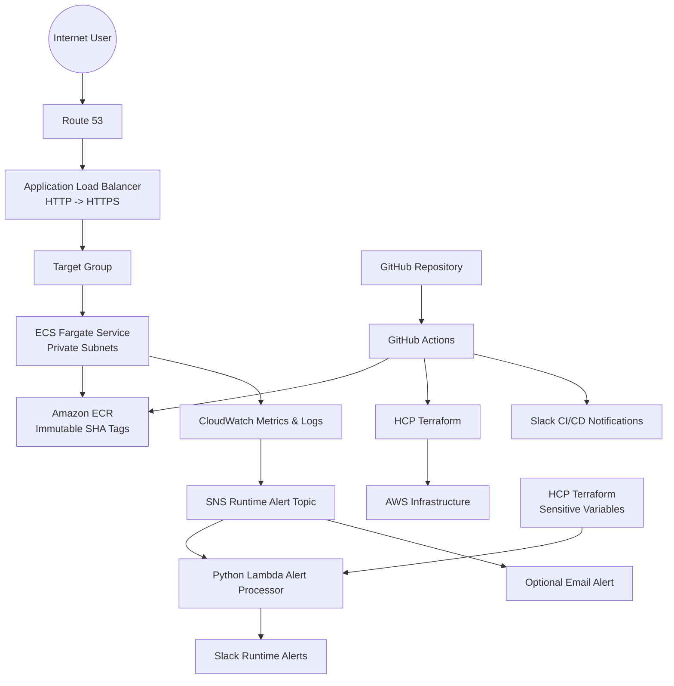

# AWS ECS Fargate — GitHub Actions CI/CD & Runtime Observability

This repository provisions and operates a containerized static web application on AWS ECS Fargate using Terraform, HCP Terraform, GitHub Actions, Amazon ECR, an Application Load Balancer, Route 53, ACM, CloudWatch, SNS, and SNS-driven Python Lambda runtime alerts to Slack, with GitHub Actions handling CI/CD.

The project is intentionally organized around two operational workflows:

1. **Infrastructure Delivery** — provision and reconcile the AWS platform and deploy an immutable container image.
2. **Runtime Operation** — keep the ECS service running, expose it securely through HTTPS, collect logs/metrics, and alert on resource pressure.

## Architecture



## Project Structure

- `main.tf` — root infrastructure composition and ACM validation dependency chain.
- `backend.tf` — HCP Terraform organization/workspace configuration.
- `variables.tf` — root deployment inputs.
- `output.tf` — operational outputs such as website URL, ECS names, ECR URL, and monitoring topic ARN.
- `modules/network` — VPC, public/private subnets, routing, Internet Gateway, and NAT Gateways.
- `modules/alb` — public Application Load Balancer, target group, HTTP redirect, and HTTPS listener.
- `modules/ssl` — ACM certificate and DNS validation metadata.
- `modules/dns` — existing Route 53 hosted-zone lookup and ALB alias records.
- `modules/ecr` — ECR repository, image scanning, and lifecycle policy.
- `modules/iam` — ECS execution role and application task role.
- `modules/ecs` — ECS cluster, Fargate task definition/service, task security group, and log group.
- `modules/monitoring` — CloudWatch metrics/alarms, Container Insights, log metric filters, SNS, Python Lambda, and Slack runtime alerting.
- `app/` — static website source and Dockerfile.
- `.github/workflows/deploy.yml` — Infrastructure Delivery + application deployment workflow.
- `.github/workflows/destroy.yml` — manually triggered infrastructure teardown workflow.
- `entry-script.sh` — optional manual image build/push and ECS redeployment helper.

## 1. Infrastructure Delivery Workflow

The production deployment path is deliberately ordered so that the first deployment does not attempt to start ECS tasks from an image that has not yet been pushed.

### Stage 1 — Bootstrap ECR

GitHub Actions runs a narrow Terraform target:

```text
terraform plan  -target=module.my-ecr
terraform apply -target=module.my-ecr
```

This creates or reconciles the ECR repository only. The targeted apply is a bootstrap step; the complete infrastructure is reconciled later by a normal Terraform plan/apply.

### Stage 2 — Build and Push

GitHub Actions builds the application from `./app` and pushes the image to ECR using the Git commit SHA as the deployment tag:

```text
<ECR repository>:<github.sha>
```

Image tags are immutable in ECR. The workflow does **not** push `latest`, which keeps the deployed artifact traceable to a specific Git commit.

### Stage 3 — Full Infrastructure Reconciliation and Deployment

After the image exists, Terraform performs a normal plan/apply with the same commit SHA:

```text
terraform plan  -var="image_tag=<github.sha>"
terraform apply -var="image_tag=<github.sha>"
```

Terraform then creates or updates:

- VPC and subnets
- Internet Gateway and NAT Gateways
- Route tables
- ECR
- IAM roles
- ACM certificate and DNS validation
- Application Load Balancer and target group
- ECS cluster and Fargate service
- CloudWatch log group
- CloudWatch alarms/dashboard
- Route 53 ALB alias records

The ECS task definition references the exact ECR SHA tag produced by the same GitHub commit.

### Deployment Notification

Slack is used for CI/CD status notifications. A successful deployment reports the commit and website URL; a failed deployment reports the GitHub Actions run for investigation.

## 2. Runtime Operation Workflow

After deployment, ECS becomes the runtime control plane for the application.

### User Request Path

```text
Internet
  -> Route 53
  -> Application Load Balancer :443
  -> HTTPS target group
  -> ECS Fargate task :80
  -> Nginx static application
```

The ECS tasks run in private subnets with no public IP address. The ECS task security group permits inbound port 80 only from the ALB security group.

### Container Runtime

The application uses `nginx:stable-alpine` as the runtime image. The Dockerfile:

1. Starts from the Nginx Alpine image.
2. Removes the default Nginx content.
3. Copies the `app/` directory into `/usr/share/nginx/html`.
4. Exposes port 80.
5. Runs Nginx in the foreground.

### ECS Service Behaviour

The ECS service is configured for Fargate with:

- `desired_count = az_count`
- private subnets
- no public IP assignment
- ALB target registration
- 100% minimum healthy deployment capacity
- 200% maximum deployment capacity
- forced new deployment when the task definition changes

This gives the deployment process a rolling replacement model rather than modifying a running container in place.

### Logging

Application/container logs are written through the ECS `awslogs` driver to:

```text
/ecs/<env_prefix>-app
```

The log group has a seven-day retention period.

### Monitoring and Runtime Alerting

CloudWatch captures five operational signals and routes every alarm state change to one SNS runtime-alert topic. SNS invokes a Python Lambda function, which enriches the notification with ECS runtime information and, for ALB health alarms, the unhealthy target details before posting the notification to Slack. An optional email subscription can remain attached to the same SNS topic.

| Signal | CloudWatch source | Default threshold | Evaluation | SNS → Lambda → Slack |
|---|---|---:|---|---|
| High CPU | `AWS/ECS / CPUUtilization` | >80% | 2 × 60s | Yes |
| Unhealthy ALB targets | `AWS/ApplicationELB / UnHealthyHostCount` | ≥1 | 2 × 60s | Yes |
| High disk | `ECS/ContainerInsights / TaskEphemeralStorageUtilization` | >80% | 2 × 60s | Yes |
| Application errors | `Custom/ECSApplication / ApplicationErrorCount` | ≥5/min | 1 × 60s | Yes |
| High memory | `AWS/ECS / MemoryUtilization` | >80% | 2 × 60s | Yes |

Fargate CPU and memory utilization are provided by ECS automatically. High disk monitoring uses ECS Container Insights with enhanced observability, which exposes Fargate task ephemeral-storage utilization. Application errors are converted from ECS CloudWatch log events into a custom metric through a CloudWatch Logs metric filter.

The SNS message is consumed by `modules/monitoring/lambda/lambda_function.py`. The Lambda receives the Slack incoming-webhook URL through its environment, populated from the sensitive `slack_webhook_url` Terraform variable stored in the HCP Terraform workspace. It queries ECS service state and, for `UnHealthyHostCount` alarms, queries the ALB target group for unhealthy targets before sending a structured Slack message.

### Runtime Alerting Flow

```text
CloudWatch metric/log signal
        ↓
CloudWatch Alarm
        ↓
SNS Runtime Alert Topic
        ↓
Python AWS Lambda
   ┌────┴──────────────┐
   │ ECS service state │
   │ ALB target health │
   └────┬──────────────┘
        ↓
HCP Terraform Sensitive Variable
        ↓
Lambda Environment Variable
        ↓
Slack Incoming Webhook
        ↓
Engineering Team
```

The runtime alerting implementation is **notification-focused**. It does not automatically restart tasks, scale the service, or modify ALB target registration.

## Security Model

### Network Isolation

- ALB is public and accepts HTTP/HTTPS traffic.
- HTTP is redirected to HTTPS.
- ECS tasks run in private subnets.
- ECS task ingress is restricted to the ALB security group.
- Tasks have no public IP addresses.
- Private subnets use NAT Gateways for outbound access required by the workload.

### IAM

The ECS execution role uses the AWS-managed `AmazonECSTaskExecutionRolePolicy` for image pulling and logging.

The application task role intentionally has no additional AWS permissions. If the application later needs access to S3, Secrets Manager, SSM, or another AWS service, the required permissions should be added as narrowly scoped policies for the specific resources.

### ECR

ECR has:

- image scanning on push
- immutable image tags
- lifecycle cleanup for untagged images after one day
- retention of the latest five images according to the repository lifecycle policy

## TLS and DNS Dependency Model

ACM certificate validation is intentionally separated from the ALB alias-record workflow:

```text
Existing Route 53 Hosted Zone
        |
        +--> ACM DNS validation records
        |        |
        |        +--> ACM certificate validation
        |                    |
        |                    +--> ALB HTTPS listener
        |
        +--> ALB alias records
```

This prevents a Terraform dependency cycle where the ALB requires the validated certificate while the certificate validation records incorrectly depend on the ALB/DNS module.

## Manual Deployment Helper

`entry-script.sh` is a secondary operational helper. The normal production path is GitHub Actions.

To use the helper, supply an existing image tag:

```bash
export IMAGE_TAG="<git-commit-sha>"
./entry-script.sh
```

The helper builds the image, pushes the supplied immutable tag, forces a new ECS deployment, and waits for the ECS service to stabilize.

## Infrastructure Teardown

The `Infrastructure Cleanup` workflow is manually triggered from GitHub Actions.

It performs:

1. Terraform initialization.
2. Terraform destroy plan.
3. Slack notification that teardown has started.
4. Terraform destroy apply.
5. Success/failure Slack notification.

Because this destroys cloud infrastructure, the workflow is protected by the GitHub `production` environment.

## Required Configuration

### HCP Terraform

The repository uses an HCP Terraform cloud backend:

```text
Organization: DigitalTech
Workspace:    gitaction_aws_container
```

The HCP Terraform workspace must have the AWS credentials/provider authentication required by the remote Terraform runs.

### GitHub Secrets

The current workflow requires:

- `TF_API_TOKEN` — HCP Terraform API token.
- `AWS_ACCESS_KEY_ID` — AWS credentials used by the GitHub Actions image-push job.
- `AWS_SECRET_ACCESS_KEY` — corresponding AWS secret.
- `CI_SLACK_WEBHOOK_URL` — optional GitHub Actions secret used only for CI/CD lifecycle notifications.

For production hardening, the GitHub Actions AWS authentication should be migrated from long-lived access keys to GitHub OIDC with a dedicated IAM role.

### HCP Terraform Variables

Set the required Terraform variables in the HCP Terraform workspace, including:

- `vpc_cidr_block`
- `env_prefix`
- `az_count`
- `domain_name`
- `alert_email` (optional)
- `slack_webhook_url` — sensitive Terraform variable containing the runtime Slack incoming-webhook URL. Store it as a sensitive Terraform variable in the `gitaction_aws_container` HCP Terraform workspace.
- `cpu` (optional; default `256`)
- `memory` (optional; default `512`)

`image_tag` is supplied by GitHub Actions during deployment.

## Validation Checklist

Before considering a deployment complete:

- Terraform plan completes without dependency errors.
- ECR contains the Git SHA image.
- ECS service reaches the desired running task count.
- ALB target health becomes healthy.
- HTTPS endpoint returns the application.
- CloudWatch logs are receiving ECS task logs.
- CPU and memory metrics appear on the dashboard.
- SNS email subscription is confirmed when `alert_email` is configured.
- GitHub Actions reports the deployment URL to Slack.

## Application Scope

The `app/` directory is a static EstateAgency template. The repository contains the front-end assets and JavaScript, but no PHP runtime/backend. The bundled contact-form JavaScript references `contactform/contactform.php`, which is not present in this repository; therefore the contact form is not a functional server-side feature of the deployed Nginx container unless an external backend is added.

## Lessons Learned

1. **Bootstrap dependencies must be explicit.** ECR must exist before the first application image can be pushed.
2. **Immutable deployment tags improve traceability.** Git SHA tags create a direct relationship between source code and the running container.
3. **Terraform dependency graphs matter.** ACM validation and ALB creation must be ordered without creating a Route 53/ALB/certificate cycle.
4. **Monitoring and remediation are different concerns.** This project currently alerts on CPU and memory pressure but does not automatically remediate those conditions.
5. **Least privilege should be intentional.** The ECS task role starts with no application AWS permissions and can be expanded only when a concrete application requirement exists.


## Runtime Slack Webhook Configuration

The runtime Slack webhook is **not stored in AWS Secrets Manager and is not committed to Git**. It is stored as a **sensitive Terraform variable in the HCP Terraform workspace** used by this repository.

Configure the workspace variable:

```text
Variable name: slack_webhook_url
Category:      Terraform variable
Sensitive:     Yes
Value:         <Slack incoming webhook URL>
```

Terraform passes this value to the runtime alert Lambda as `SLACK_WEBHOOK_URL`. The value is marked sensitive in Terraform configuration so it is not displayed as a normal Terraform output. The webhook should never be echoed by GitHub Actions or committed to the repository.

### CI/CD Slack Notifications

GitHub Actions remains the CI/CD execution layer. If deployment/teardown lifecycle messages are desired, configure the separate GitHub Actions secret `CI_SLACK_WEBHOOK_URL`. This keeps the **runtime alert webhook** managed by HCP Terraform distinct from the **CI/CD notification webhook** used by GitHub Actions.

If a single webhook is preferred for both purposes, the same Slack webhook value can be stored in both systems, but the repository does not require the runtime webhook to be stored in AWS Secrets Manager.
